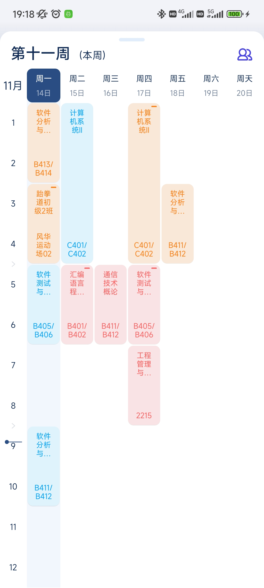
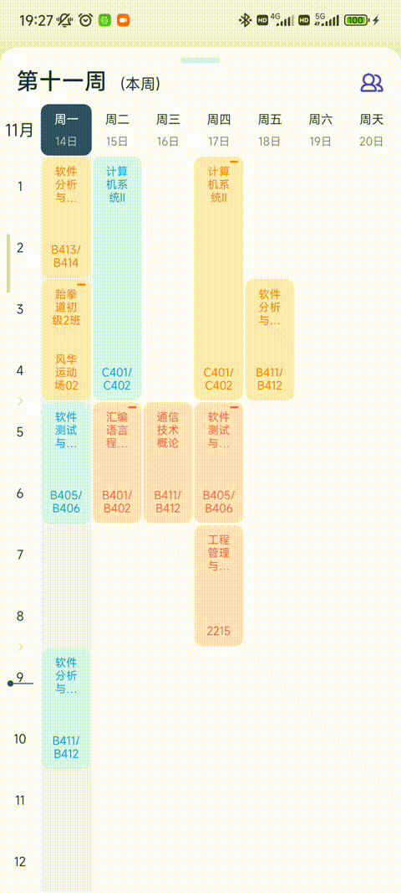

# NetLayout


 一个功能更全面的网状布局

NetLayout 是一个类似于官方 GridLayout 的控件，但与它不同在于，NetLayout 支持重叠、长度和宽度的不统一，你可以把 NetLayout 看成一个加上了网格约束的 FrameLayout

在之前接到了写掌邮新课表的需求，因为代码过老，有了重构的想法，所以写了一个网状布局，课表项目请查看掌上重邮，本项目是支撑整个课表的基础控件



图中就是我设计的课表控件，里面包含了8列，14行（包含了折叠的中午和傍晚），并且还有以下功能：

- 支持动态折叠中午和傍晚时间段
- 展开中午和傍晚后支持上下滑动，并且能与外层的 BottomSheetBegavior 联动
- 课程重叠的处理
- 支持多指触摸
- 长按空白处上下移动生成新的 item
- 长按 item 支持移动



## 添加依赖


````kotlin
dependencies { 
    implementation("io.github.985892345:NetLayout:x.x.x") // 版本号请看上方标签
}
````

## 使用方式

```xml
<NetLayout
    app:net_rowCount="6"
    app:net_columnCount="6">
    <View
        android:layout_width="match_parent"
        android:layout_height="match_parent"
        app:net_layout_gravity="center"
        app:net_layout_startRow="0"
        app:net_layout_endRow="1"
        app:net_layout_startColumn="0"
        app:net_layout_endColumn="2"/>
</NetLayout>
```

### 布局属性

| 属性            | 作用                                      |
| --------------- | ----------------------------------------- |
| net_rowCount    | 总行数                                    |
| net_columnCount | 总列数                                    |
| net_isDebug     | 是否处于 debug 状态（开启后会绘制表格线） |

### 子View属性

| 属性               | 作用                                  |
| ------------------ | ------------------------------------- |
| net_layout_gravity | 与 FrameLayout 的 layout_gravity 一致 |
| net_layout_startRow       | 开始行的索引值，以 0 开始             |
| net_layout_endRow         | 结束行的索引值，以 0 开始             |
| net_layout_startColumn    | 开始列的索引值，以 0 开始             |
| net_layout_endColumn      | 结束列的索引值，以 0 开始             |

### 方法

NetLayout 实现了以下自定义接口：[INetLayout](https://github.com/985892345/NetLayout/blob/master/netlayout/src/main/java/com/ndhzs/netlayout/INetLayout.kt)、[IRow](https://github.com/985892345/NetLayout/blob/master/netlayout/src/main/java/com/ndhzs/netlayout/orientation/IRow.kt)、[IColumn](https://github.com/985892345/NetLayout/blob/master/netlayout/src/main/java/com/ndhzs/netlayout/orientation/IColumn.kt)

#### [INetLayout](https://github.com/985892345/NetLayout/blob/master/netlayout/src/main/java/com/ndhzs/netlayout/INetLayout.kt)

暴露一些参数设置和查找子 View 的方法

```kotlin
interface INetLayout : IRow, IColumn {
   
   /**
    * 添加一个子 view
    *
    * ## 注意
    * - 内部重写了 addView() 用了排序插入
    */
   fun addNetChild(child: View, lp: NetLayoutParams)
   
   /**
    * 倒序查找子 View
    *
    * 倒序的原因是因为一般排在后面的显示在最上面
    *
    * @see findViewUnderByRowColumn
    */
   fun findViewUnderByXY(x: Int, y: Int): View?
   
   /**
    * 根据行和列倒序查找子 View
    * @see findViewUnderByXY
    */
   fun findViewUnderByRowColumn(row: Int, column: Int): View?
   
   /**
    * 设置行数和列数
    */
   fun setRowColumnCount(row: Int, column: Int)
   
   /**
    * 设置行或列比重被修改的监听
    */
   fun addOnWeightChangeListener(l: OnWeightChangeListener)
   
   /**
    * 删除监听
    */
   fun removeOnWeightChangeListener(l: OnWeightChangeListener)
}
```

#### [IRow](https://github.com/985892345/NetLayout/blob/master/netlayout/src/main/java/com/ndhzs/netlayout/orientation/IRow.kt)

用于控制行的接口

```kotlin
interface IRow {
  
   /**
    * 总列数
    */
   val rowCount: Int
   
   /**
    * 得到 [y] 对应的行数，超出控件范围会得到边界行，控件没有被测量时得到 -1
    * @return 得到 [y] 对应的行数，超出控件范围会得到边界行，控件没有被测量时得到 -1
    */
   fun getRow(y: Int): Int
   
   /**
    * 得到 [start] 到 [end] 行之间的高度，当视图没有被测量时返回 0，允许 [start] > [end]
    *
    * [start] 和 [end] 有如下规律：
    * ```
    * -----------------  ←--- start 代表该一行的开始
    *      这是一行
    * -----------------  ←--- end   代表该一行的结束
    *
    * 如：
    *         ╭--→  -----------------  ←------- (0, -1)
    *         ┆            0
    *  (0, 1) ┆     -----------------  ←--╮
    *         ┆            1              ┆
    *         ╰--→  -----------------     ┆ (1, 2)  （如果是 (3, 0) 将得到反向负值）
    *                      2              ┆
    *               -----------------  ←--╯
    * ```
    *
    * @return [start] 到 [end] 行之间的高度
    */
   fun getRowsHeight(start: Int, end: Int): Int
   
   /**
    * 重新分配第 [row] 行的显示比重
    * @param weight 比重，默认情况下为 1F
    */
   fun setRowShowWeight(row: Int, weight: Float)
   
   /**
    * 设置第 [row] 行（以 0 开始）的***初始比重***
    *
    * ## 作用
    * 设置初始比例后，可以实现在每行高度都不变的情况下扩大整个布局的高度
    *
    * ## 适用范围
    * 只有在 `onMeasure()` 中得到的高度测量模式不为 EXACTLY 才能触发
    *
    * ### 常见于以下情况：
    * - 自身 `layout_height` 为 `wrap_content`
    * - 父布局 `layout_height` 为 `wrap_content` 且自身 `layout_height` 为 `match_parent`
    * - 父布局为 ScrollView、NestedScrollView、ListView(当自身 `layout_height` 为 `match_parent` 或 `wrap_content` 时)
    *
    * ## 注意事项
    * 设置后并不会改变显示的比重，如果需要改变比重，请使用 [setRowShowWeight] 方法
    *
    * @param weight 比重，默认情况下为 1F
    * @see setRowShowWeight
    */
   fun setRowInitialWeight(row: Int, weight: Float)
   
   /**
    * 得到 [start] - [end] 行的显示比重，具体逻辑可看：[getRowsHeight]
    */
   fun getRowsShowWeight(start: Int, end: Int): Float
   
   /**
    * 得到第 [start] - [end] 列的初始比重，具体逻辑可看：[getRowsHeight]
    */
   fun getRowInitialWeight(start: Int, end: Int): Float
   
   /**
    * 将自身的行比重与 [layout] 同步
    * @return 不符合要求返回 false
    */
   fun syncRowWeight(layout: IRow): Boolean
}
```

#### [IColumn](https://github.com/985892345/NetLayout/blob/master/netlayout/src/main/java/com/ndhzs/netlayout/orientation/IColumn.kt)

用于控制列的接口

```kotlin
interface IColumn {
   
   /**
    * 总行数
    */
   val columnCount: Int
   
   /**
    * 得到 [x] 对应的列数，超出控件范围会得到边界列，控件没有被测量时得到 -1
    * @return 得到 [x] 对应的列数，超出控件范围会得到边界列，控件没有被测量时得到 -1
    */
   fun getColumn(x: Int): Int
   
   /**
    * 得到 [start] 到 [end] 列之间的宽度，当视图没有被测量时返回 0
    *
    * [start] 和 [end] 有如下规律（逆时针旋转 90 度）：
    * ```
    * -----------------  ←--- start 代表该一列的开始
    *      这是一列
    * -----------------  ←--- end   代表该一列的结束
    *
    * 如：
    *         ╭--→  -----------------  ←------- (0, -1)
    *         ┆            0
    *  (0, 1) ┆     -----------------  ←--╮
    *         ┆            1              ┆
    *         ╰--→  -----------------     ┆ (1, 2)  （如果是 (3, 0) 将得到反向负值）
    *                      2              ┆
    *               -----------------  ←--╯
    * ```
    *
    * @return [start] 到 [end] 列之间的宽度
    */
   fun getColumnsWidth(start: Int, end: Int): Int
   
   /**
    * 重新分配第 [column] 列的显示比重
    * @param weight 比重，默认情况下为 1F
    */
   fun setColumnShowWeight(column: Int, weight: Float)
   
   /**
    * 设置第 [column] 列（以 0 开始）的***初始比重***
    *
    * ## 作用
    * 设置初始比例后，可以实现在每列宽度都不变的情况下扩大整个布局的宽度
    *
    * ## 适用范围
    * 只有在 `onMeasure()` 中得到的宽度测量模式不为 EXACTLY 才能触发
    *
    * ### 常见于以下情况：
    * - 自身 `layout_width` 为 `wrap_content`
    * - 父布局 `layout_width` 为 `wrap_content` 且自身 `layout_width` 为 `match_parent`
    * - 父布局为 HorizontalScrollView
    *
    * ## 注意事项
    * 设置后并不会改变显示的比重，如果需要改变比重，请使用 [setColumnShowWeight] 方法
    *
    * @param weight 比重，默认情况下为 1F
    * @see setColumnShowWeight
    */
   fun setColumnInitialWeight(column: Int, weight: Float)
   
   /**
    * 得到第 [start] - [end] 列的显示比重，具体逻辑可看：[getColumnsWidth]
    */
   fun getColumnsShowWeight(start: Int, end: Int): Float
   
   /**
    * 得到第 [start] - [end] 列的初始比重，具体逻辑可看：[getColumnsWidth]
    */
   fun getColumnInitialWeight(start: Int, end: Int): Float
   
   /**
    * 将自身的列比重与 [layout] 同步
    * @return 不符合要求返回 false
    */
   fun syncColumnWeight(layout: IColumn): Boolean
}
```

### [NetLayout2](https://github.com/985892345/NetLayout/blob/master/netlayout/src/main/java/com/ndhzs/netlayout/view/NetLayout2.kt)

NetLayout 可用于一般性的使用，如果你想设置一些监听可以使用 NetLayout2

NetLayout2 的功能如下：

- 可扩展事件分发
- 提供绘制的分发
- 提供在试图被摧毁时保存数据的接口
- 添加和删除子 View 的回调
- 子 View visibility 改变的监听

#### 事件分发扩展

参考了 RV 的 ItemTouchListener，分离了 NetLayout2 的事件分发

这个实现逻辑比较复杂，感兴趣的话可以去看 [OnItemTouchListener](https://github.com/985892345/NetLayout/blob/master/netlayout/src/main/java/com/ndhzs/netlayout/touch/OnItemTouchListener.kt) 和 [TouchDispatcher](https://github.com/985892345/NetLayout/blob/master/netlayout/src/main/java/com/ndhzs/netlayout/touch/TouchDispatcher.kt)，里面有比较详细的注释

##### 多指触摸

在前面事件分发的基础上，我封装了多指触摸逻辑，你只需要直接使用 [MultiTouchDispatcherHelper](https://github.com/985892345/NetLayout/blob/master/netlayout/src/main/java/com/ndhzs/netlayout/touch/multiple/MultiTouchDispatcherHelper.kt) 即可

```kotlin
val netLayout2 = NetLayout(context)
val multiTouch = MultiTouchDispatcherHelper()
val dispatcher = XXXPointerDispatcher() // 事件分发者，实现于 IPointerDispatcher 接口
netLayout2.addItemTouchListener(multiTouch)
multiTouch.addPointerDispatcher(dispatcher)

// 事件处理者，实现于 IPointerTouchHandler 接口
val pointerTouchHandler1 = PointerTouchHandler1()
val pointerTouchHandler2 = PointerTouchHandler2()
val pointerTouchHandler3 = PointerTouchHandler3()

// 将事件处理者添加到分发者中（下面这步由你具体的实现类实现）
dispatcher.addPointerTouchHandler(pointerTouchHandler1)
dispatcher.addPointerTouchHandler(pointerTouchHandler2)
dispatcher.addPointerTouchHandler(pointerTouchHandler3)
```

###### [IPointerDispatcher](https://github.com/985892345/NetLayout/blob/master/netlayout/src/main/java/com/ndhzs/netlayout/touch/multiple/IPointerDispatcher.kt)

- 判断是否需要拦截当前手指的事件
- 用于集结同一类型事件的分发，比如：长按移动和长按生成事务，这属于不同类型的事件，需要写两个 IPointerDispatcher
- 用于支持延时拦截该手指的事件

###### [IPointerTouchHandler](https://github.com/985892345/NetLayout/blob/master/netlayout/src/main/java/com/ndhzs/netlayout/touch/multiple/IPointerTouchHandler.kt)

当前手指对应事件的处理者。意思就是一根手指只会对应一个实现了 IPointerTouchHandler 的对象

###### [IPointerEvent](https://github.com/985892345/NetLayout/blob/master/netlayout/src/main/java/com/ndhzs/netlayout/touch/multiple/event/IPointerEvent.kt)

单个手指事件的封装。

我将 MotionEvent 进行了拆分，分离成了每根手指独立的事件，即每根手指都能接收到独立的 Down → Move → Up 事件


其他几个监听比较简单，就不再叙述

